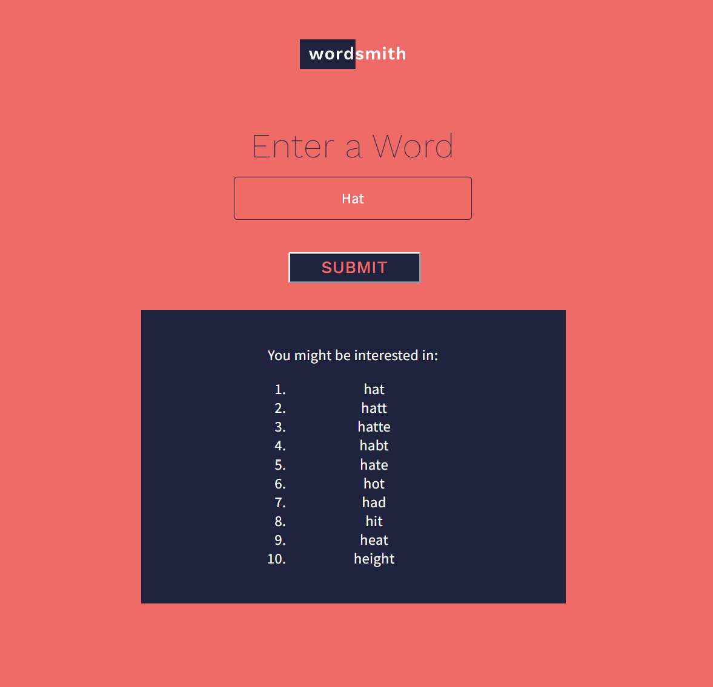

# Word Smith

Word smith is a JavaScript API built to connect to the [Datamuse API](https://www.datamuse.com/api/) and render the fetched information in the browser.

The Datamuse API is a word-finding query engine for developers. It can be used in apps to find words that match a given set of constraints that are likely in a given context.

If the request is successful, we’ll get back an array of words that sound like the word we typed into the input field.

## Getting Started
1. Clone the project by running `git clone {insertProjectURL}`
2. Copy the absolute path for `index.html` into your favourite browser and try typing some words.
3. Have fun!

## Technologies
- JavaScript (ES6)
- HTML
- CSS